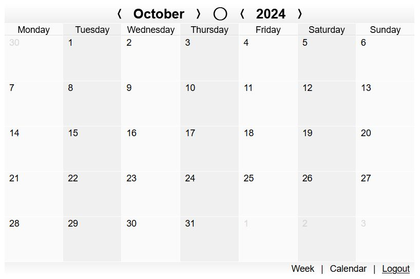
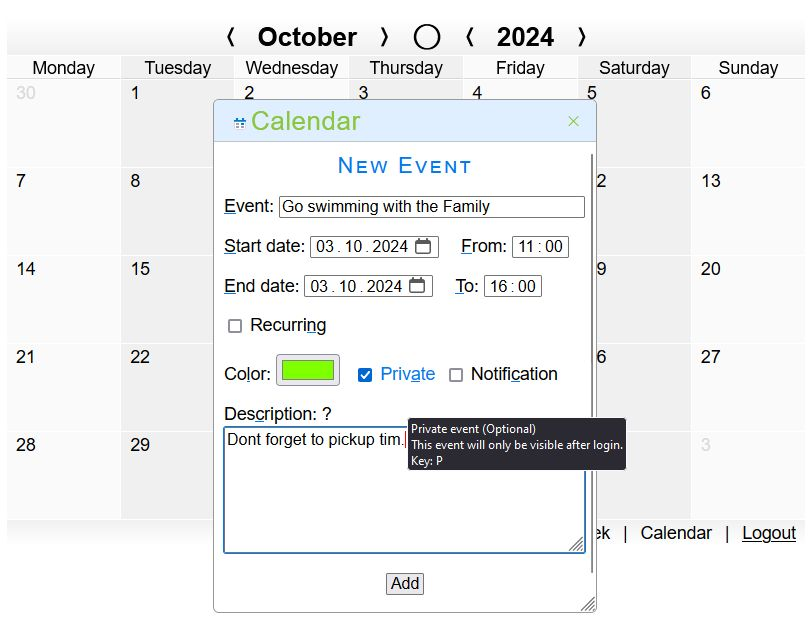
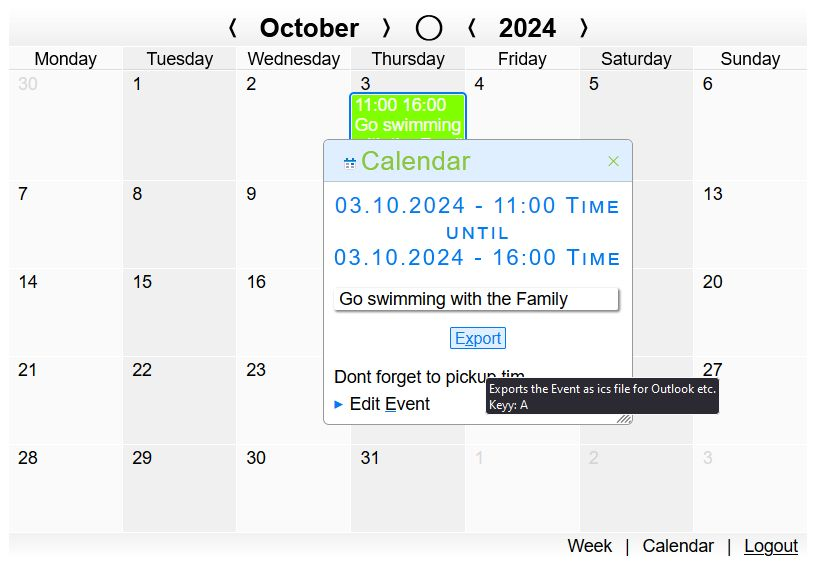

This is a Fork from Werner Zenks webcalendar. You can obtain a copy of the original from [Tommy Hermanns's Archive](https://www.mobirise-tutorials.com/Download-Archiv/)

# webcalendar

* ***What does it do?*** With the event calendar you can save events in a DB table (SQLite database file). The events are clearly displayed in a calendar. Navigation of the calendar is completely via JavaScript (Ajax), so no page changes are necessary. The calendar shows all the days of a month in the form of an HTML table. Buttons can be used to navigate to the previous month / previous year or the coming month / year. Events can be entered directly in the calendar (edit, move, copy or delete).
* ***Why is it useful?*** No installation or container environments needed. The requirements are just php 7 or up. Works with local sqlite_3 php extension.
* ***Which browsers are supported?*** Chrome, Firefox, LibreWolf, Opera, Opera GX, Edge, Chromium, Brave, Vivaldi, and Safari.

## Install
Copy calendar.php, webcalendar.js and webcalendar.css to your www dir and insert a div with the "zenk-calendar" keyword id into your html. Update file permissions as needed and have a look at the paths to point to the stylesheet and the javascript. Do not forget the location of the calendar.php. Its location has to be updated in webcalendar.js on the first lines. You can define the calendar language and timezone (important for ics export) inside the webcalendar.php

```
<!DOCTYPE html>
<html lang="de">
  <head>
    <meta charset="UTF-8" />
    <meta name="viewport" content="width=device-width, initial-scale=1.0" />
    <meta name="color-scheme" content="light dark" />
    <title>Event-Calendar (SQLite)</title>
    <link rel="stylesheet" href="webcalendar.css" />
    <script src="webcalendar.js" defer></script>
    <style>
      /* Only for this Demo! */
      body {
        margin: 3rem 1rem 68rem 0.5rem;
      }
    </style>
  </head>
  <body>
    <div id="zenk-calendar" style="max-width:800px;"><noscript>This Webcalendar needs JavaScript enabled!</noscript></div>
  </body>
</html>
```

## Screenshots
Default "light" layout:<br>


Summary of appointment:<br>


Login for administrator:<br>


Create a new event:<br>

